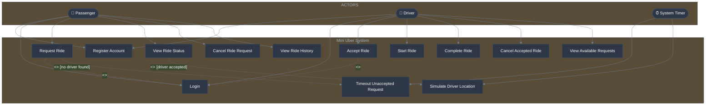
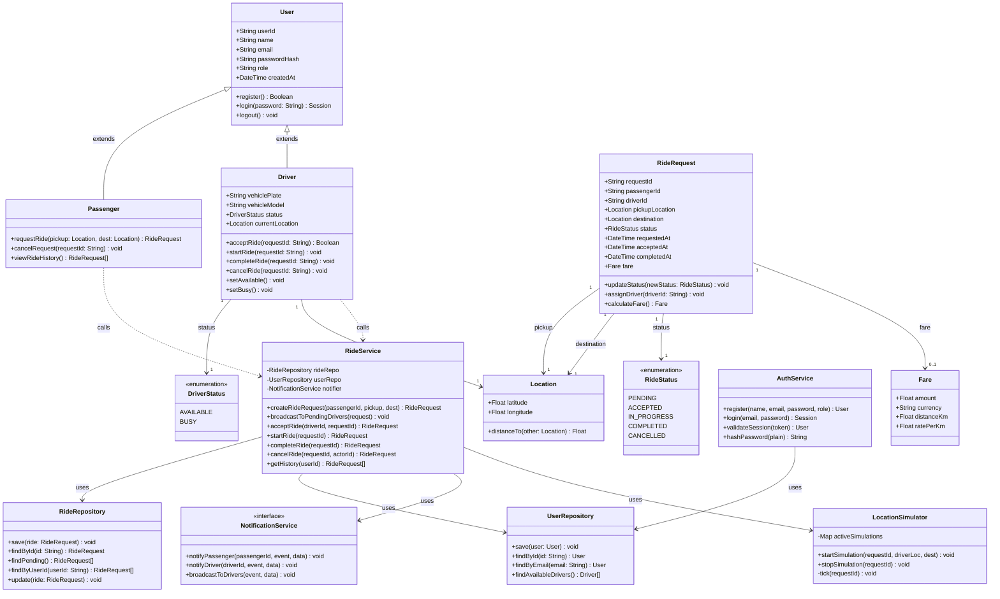
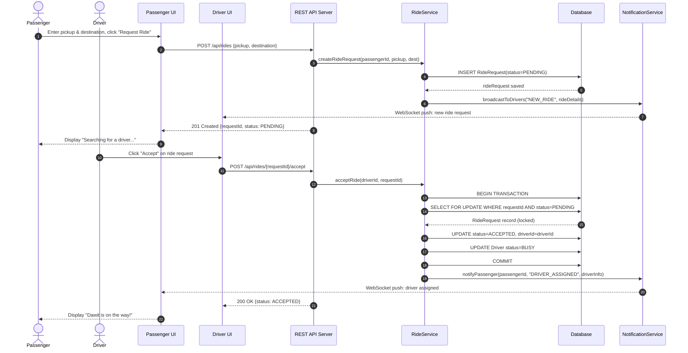
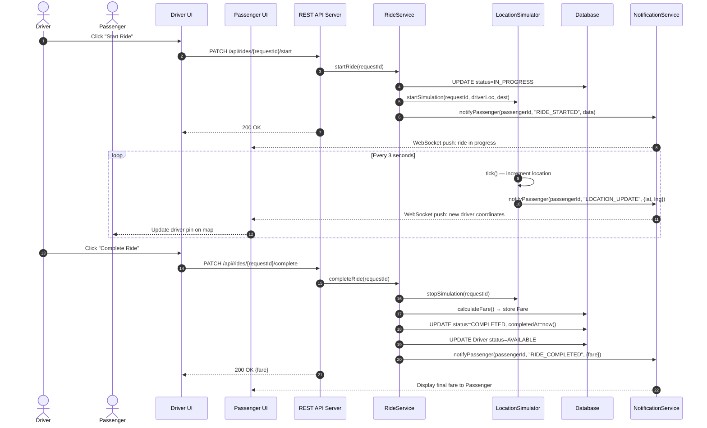
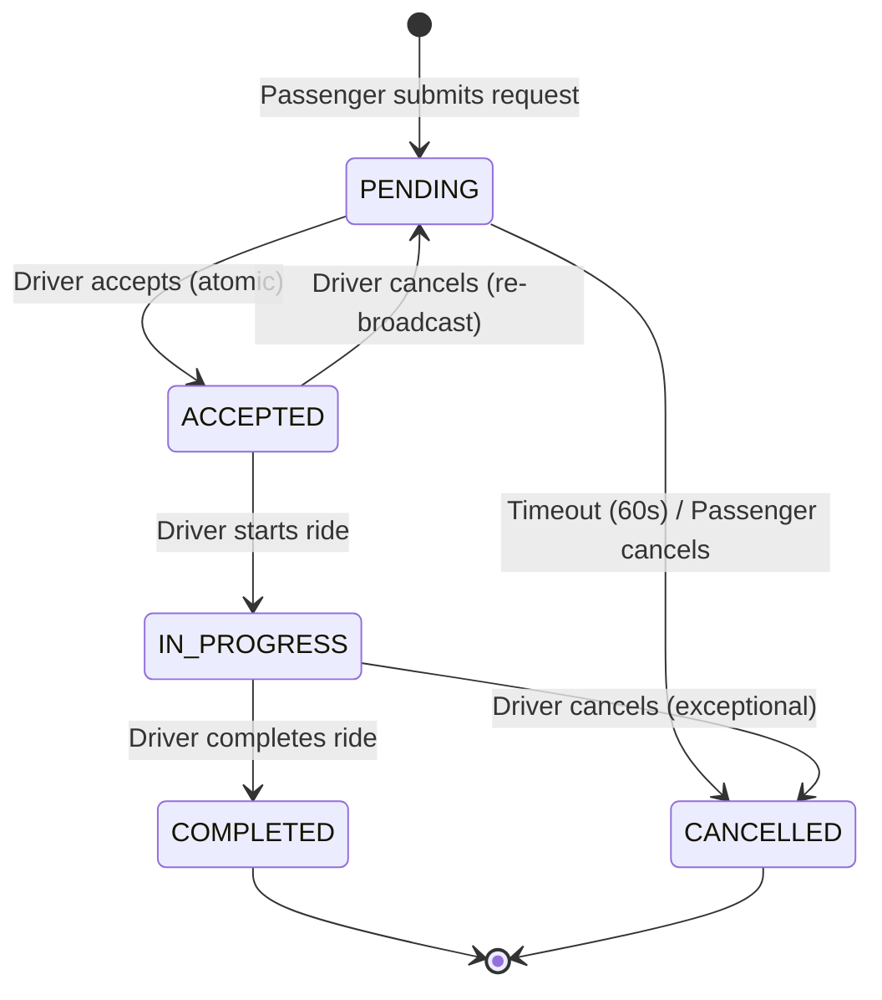
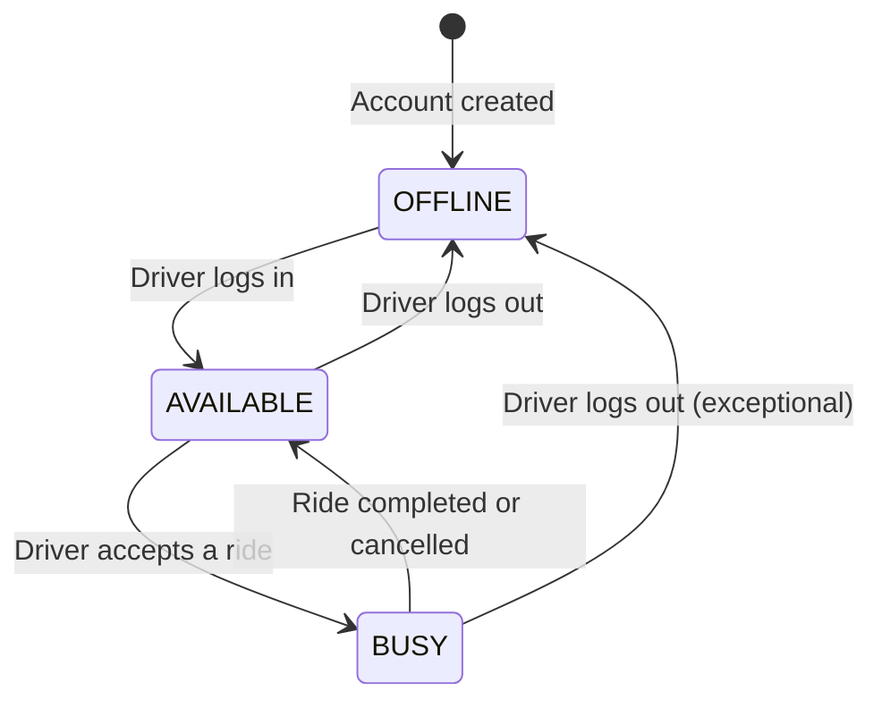
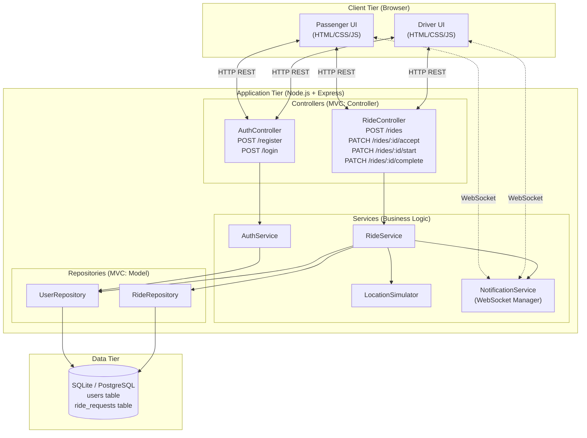
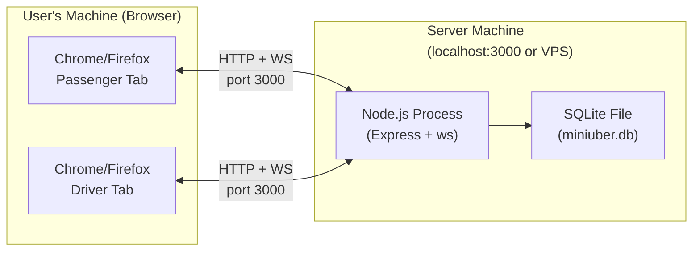

# Mini Uber — Object-Oriented Software Engineering Documentation

**Course:** Object-Oriented Software Engineering (OOSE)
**Project:** Mini Uber — Ride-Sharing MVP
**Build Constraint:** 6-Hour Implementation Sprint
**Document Version:** 1.0
**Date:** 2026-05-09

---

# PART 1: SYSTEM ANALYSIS

---

## 1. Introduction

This document constitutes the formal System Analysis for **Mini Uber**, a minimal viable ride-sharing application developed under strict time constraints as a university coursework project. The goal of system analysis is to understand and model *what* the system must do, independent of implementation details. The analysis is grounded in Object-Oriented Software Engineering (OOSE) principles, employing use case modeling, object modeling, and dynamic behavioral modeling to fully specify the system's required behavior.

The Mini Uber system enables passengers to request rides and drivers to accept and fulfill those requests in near-real-time. The system is intentionally scoped to the minimum functional core necessary to demonstrate a working ride-sharing flow within a 6-hour build window, while maintaining rigorous OOSE documentation standards.

---

## 2. Current System

### 2.1 Overview of the Traditional Taxi System

The traditional taxi-hailing system operates through a combination of street-hailing, telephone dispatch, and taxi stand queuing. Its core processes are manual, asynchronous, and largely non-digital.

**Process Flow:**

1. A passenger physically locates a taxi rank, calls a dispatch center, or hails a passing cab from the street.
2. A human dispatcher receives the call and via radio or mobile telephone contacts the nearest available driver.
3. The driver acknowledges and navigates to the pickup location using personal knowledge or a paper map.
4. Fare is calculated manually using a taximeter and collected in cash at journey's end.
5. No persistent digital record is automatically generated for either party.

### 2.2 Deficiencies of the Current System

| Deficiency | Impact |
|---|---|
| No real-time location tracking | Passenger has no visibility into driver ETA |
| Manual dispatch | High latency between request and driver assignment |
| Cash-only payment | No automated billing, prone to disputes |
| No driver-passenger matching algorithm | Inefficient geographic assignment |
| No feedback or rating mechanism | No quality assurance loop |
| No audit trail | Disputes over fares or conduct are unresolvable |
| Geography-dependent | Passengers must physically be in a covered zone to find a cab |

---

## 3. Proposed System

### 3.1 Overview

The proposed system, **Mini Uber**, is a client-server web application that digitizes and automates the core ride-sharing flow. It replaces the manual dispatch process with real-time request broadcasting and driver self-selection. Location tracking is simulated server-side for MVP scope. All interactions are mediated through a browser-based user interface, and the system maintains a persistent database of rides, users, and transactions.

The system supports exactly two user roles: **Passenger** and **Driver**. An administrative back-end is out of scope for this MVP.

---

### 3.2 Functional Requirements

The following functional requirements define the observable behaviors the system must exhibit. They are numbered for traceability.

**FR-01:** The system shall allow a new user to register as either a Passenger or a Driver.
**FR-02:** The system shall allow registered users to authenticate using an email address and password.
**FR-03:** The system shall allow an authenticated Passenger to submit a ride request specifying a pickup location and a destination.
**FR-04:** The system shall broadcast the ride request to all available authenticated Drivers.
**FR-05:** The system shall allow an authenticated Driver to accept a pending ride request.
**FR-06:** The system shall prevent more than one Driver from accepting the same ride request.
**FR-07:** The system shall notify the Passenger when a Driver has accepted their request.
**FR-08:** The system shall display a simulated real-time location of the Driver to the Passenger.
**FR-09:** The system shall allow the Driver to mark a ride as "In Progress" upon passenger pickup.
**FR-10:** The system shall allow the Driver to mark a ride as "Completed" upon arrival at the destination.
**FR-11:** The system shall calculate and display the final fare upon ride completion, based on a fixed rate per unit distance.
**FR-12:** The system shall maintain a ride history accessible to both Passenger and Driver for past trips.
**FR-13:** The system shall update the Driver's status to "Available" after a ride is completed or cancelled.

---

### 3.3 Non-Functional Requirements

**NFR-01 — Performance:** The system shall process and broadcast a ride request to all available drivers within 2 seconds of submission.
**NFR-02 — Usability:** The user interface shall require no training; a first-time user shall be able to complete a ride request within 60 seconds.
**NFR-03 — Reliability:** The system shall ensure that a ride request is accepted by exactly one driver (mutual exclusion guarantee).
**NFR-04 — Security:** User passwords shall be stored as salted hashes. Session tokens shall expire after 24 hours of inactivity.
**NFR-05 — Scalability (Future):** The architecture shall not preclude horizontal scaling, though scaling is not required for the MVP.
**NFR-06 — Maintainability:** Code shall adhere to a clear MVC separation so that UI, business logic, and data layers can be modified independently.
**NFR-07 — Portability:** The application shall be accessible via any modern browser (Chrome, Firefox, Safari) without requiring client-side installation.

---

### 3.4 Constraints (Pseudo-Requirements)

Pseudo-requirements constrain the design space without being direct business requirements. They arise from environmental, organizational, or time factors.

**PSR-01 — Build Time Constraint:** The entire system (front-end, back-end, database) must be implemented by a single developer in **6 hours**. This constraint directly dictates technology choices, scope limitations, and the exclusion of non-core features.
**PSR-02 — Technology Stack:** The system shall be built using a JavaScript-centric stack (Node.js / Express backend, React or plain HTML/JS frontend, SQLite or PostgreSQL database) to minimize context-switching overhead.
**PSR-03 — Location Simulation:** True GPS integration is out of scope. Driver location shall be simulated by the server incrementing coordinates toward the destination at a fixed time interval.
**PSR-04 — Payment:** No real payment gateway integration. Fare is calculated and displayed as a number only; no actual transaction is processed.
**PSR-05 — No Mobile Native App:** The system shall be delivered as a responsive web application only.
**PSR-06 — Single Server Deployment:** The MVP shall run on a single server/local machine. No cloud deployment is required.
**PSR-07 — No Email Verification:** User registration shall be immediate without email confirmation, to reduce implementation time.

---

### 3.5 System Models

#### 3.5.1 Scenarios

Scenarios are informal narratives describing system usage from an end-user perspective. They ground the formal models that follow.

---

**Scenario 1: Successful Ride — Happy Path**

Hana is a university student who opens the Mini Uber web app on her laptop. She logs in as a Passenger. On her dashboard she enters "Arat Kilo Campus" as her pickup location and "Bole Atlas Mall" as her destination, then taps "Request Ride." The system immediately broadcasts her request. Dawit, a driver who is logged into the Driver Dashboard, sees the new ride request appear with Hana's pickup and destination details. He clicks "Accept." Hana's screen updates to show "Driver Accepted — Dawit is on his way." A small map simulation shows Dawit's icon moving toward her. Dawit arrives, clicks "Start Ride," and the status updates for both parties. They reach the destination; Dawit clicks "Complete Ride." Both see the final fare of 85 ETB. The ride appears in both their ride histories.

---

**Scenario 2: No Driver Available**

Yonas opens the app, logs in, and submits a ride request. There are no online drivers at this time. The system displays the message "Looking for a driver…" and continues polling. After 60 seconds, it displays "No drivers available at this time. Please try again later." The ride request is cancelled and removed from the active queue.

---

**Scenario 3: Driver Cancels**

Almaz accepts a ride from passenger Bereket. Before starting the ride, Almaz clicks "Cancel Ride." The system notifies Bereket that the driver cancelled and re-broadcasts the request so another driver may accept it. Almaz's status returns to "Available."

---

#### 3.5.2 Use Case Model

**Actors:**
- **Passenger** — A registered user who requests rides.
- **Driver** — A registered user who accepts and fulfills rides.
- **System (Timer)** — An automated system actor that handles timeout logic.

---



---

**Use Case Specifications (Abbreviated):**

| Use Case | UC-03: Request Ride |
|---|---|
| **Actor** | Passenger |
| **Precondition** | Passenger is authenticated |
| **Main Flow** | 1. Passenger enters pickup & destination. 2. System validates inputs. 3. System creates RideRequest with status PENDING. 4. System broadcasts to available Drivers. 5. System displays "Searching…" to Passenger. |
| **Alternate Flow** | A1: No drivers online → System displays timeout message after 60s. |
| **Postcondition** | A RideRequest record exists with status PENDING or CANCELLED. |

| Use Case | UC-07: Accept Ride |
|---|---|
| **Actor** | Driver |
| **Precondition** | Driver is authenticated and status is AVAILABLE. RideRequest status is PENDING. |
| **Main Flow** | 1. Driver selects a request from the list. 2. System atomically sets RideRequest status to ACCEPTED and assigns driverId. 3. System sets Driver status to BUSY. 4. System notifies Passenger. |
| **Alternate Flow** | A1: Another driver accepted first → System returns "Ride already taken" to current driver. |
| **Postcondition** | RideRequest status is ACCEPTED; Driver status is BUSY. |

---

#### 3.5.3 Object Model

##### 3.5.3.1 Data Dictionary

| Term | Type | Description |
|---|---|---|
| `User` | Entity Class | A registered participant in the system. Parent of Passenger and Driver. |
| `Passenger` | Entity Class | A User who requests rides. |
| `Driver` | Entity Class | A User who fulfills ride requests. Has vehicle information and availability status. |
| `RideRequest` | Entity Class | The core transactional entity. Represents a Passenger's request for transport from a pickup to a destination. |
| `Location` | Value Object | An immutable pair of latitude and longitude coordinates representing a geographic point. |
| `RideStatus` | Enumeration | The lifecycle state of a RideRequest: PENDING → ACCEPTED → IN_PROGRESS → COMPLETED or CANCELLED. |
| `DriverStatus` | Enumeration | The availability state of a Driver: AVAILABLE or BUSY. |
| `Fare` | Value Object | The calculated monetary cost of a completed ride, in ETB, derived from distance and rate. |
| `AuthService` | Service Class | Manages user registration, authentication, and session token issuance. |
| `RideService` | Service Class | Encapsulates all business logic related to ride lifecycle management. |
| `LocationSimulator` | Service Class | Periodically updates a Driver's simulated current location toward a target location. |
| `NotificationService` | Service Class | Delivers real-time status updates to connected clients. |
| `RideRepository` | Repository Class | Provides CRUD persistence operations for RideRequest entities. |
| `UserRepository` | Repository Class | Provides CRUD persistence operations for User entities. |
| `Session` | Value Object | A short-lived token issued upon login, binding a User identity to an HTTP session. |

---

##### 3.5.3.2 Class Diagrams



---

#### 3.5.4 Dynamic Models

##### Sequence Diagram: Request and Accept Ride



---

##### Sequence Diagram: Start and Complete Ride



---

##### State Diagram: RideRequest Lifecycle



---

##### State Diagram: Driver Lifecycle



---

#### 3.5.5 User Interface (Screen Descriptions)

The following describes the minimum required screens. No wireframe tool is used given time constraints; screens are precisely described for implementation.

**Screen 1 — Registration / Login Page**
A single page with two tabs: "Register" and "Login." The Register tab collects: Full Name, Email, Password, and a Role selector (radio buttons: Passenger / Driver). Drivers additionally provide: Vehicle Model and License Plate. The Login tab collects: Email and Password. On success, users are redirected to their role-specific dashboard.

**Screen 2 — Passenger Dashboard**
Displays the Passenger's name and a ride request form containing two text inputs (Pickup Location, Destination). A large "Request Ride" button submits the form. Below the form, a status panel dynamically updates: "Searching…" → "Driver Assigned: [Name] — ETA 5 min" → "Ride in Progress." A simple CSS-animated map placeholder shows a moving driver icon. A "Ride History" tab shows past trips in a sortable table.

**Screen 3 — Driver Dashboard**
Displays the Driver's name and current status badge (AVAILABLE / BUSY). When available, a scrollable list of "Available Ride Requests" is shown. Each request card displays: Passenger name, Pickup Location, Destination, and an "Accept" button. Once a ride is accepted, the list is replaced by a "Current Ride" panel showing passenger details, pickup location, and two action buttons: "Start Ride" and "Cancel." After starting, the "Start Ride" button is replaced by "Complete Ride." A "Ride History" tab shows past trips.

**Screen 4 — Shared: Error/Notification Toast**
A non-blocking notification component (top-right corner) that surfaces real-time events: "Ride request timed out," "Driver cancelled — re-searching," "Ride completed. Fare: 85 ETB."

---

## 4. Glossary

| Term | Definition |
|---|---|
| **OOSE** | Object-Oriented Software Engineering — a software engineering methodology that organizes systems around objects and classes. |
| **MVP** | Minimum Viable Product — the smallest set of features that delivers core value. |
| **Actor** | An entity (human or system) that interacts with the system from the outside. |
| **Use Case** | A description of a system's behavior as it responds to a request from an actor. |
| **Sequence Diagram** | A UML diagram showing object interactions arranged in time sequence. |
| **State Diagram** | A UML diagram showing the states of an object and the transitions between them. |
| **Value Object** | An object with no conceptual identity, defined entirely by its attribute values (e.g., Location). |
| **Entity Class** | A class that represents a domain concept with a persistent identity (e.g., User, RideRequest). |
| **Service Class** | A stateless class that encapsulates domain operations not naturally belonging to an entity. |
| **Repository** | A class that mediates between the domain layer and the data mapping layer. |
| **WebSocket** | A communication protocol providing full-duplex channels over a single TCP connection, used here for real-time push notifications. |
| **Atomic Operation** | A database operation that executes as a single, indivisible unit, ensuring data consistency. |
| **ETB** | Ethiopian Birr — the currency used for fare calculation in this deployment context. |
| **Fare** | The monetary charge for a completed ride, calculated as distance × rate per km. |
| **PENDING** | Initial RideRequest state after submission, awaiting driver acceptance. |
| **IN_PROGRESS** | RideRequest state indicating the driver has picked up the passenger and the trip is underway. |

---
---

# PART 2: SYSTEM DESIGN

---

## 1. Introduction

This document constitutes the formal System Design for **Mini Uber**. Whereas Part 1 (System Analysis) established *what* the system must do, Part 2 specifies *how* it will be implemented. The design directly traces to the analysis: every functional requirement, object class, and use case identified in Part 1 has a corresponding design decision herein.

The design adheres to the following OOSE principles:
- **Separation of Concerns:** Strict layering of Presentation, Business Logic, and Data.
- **Open/Closed Principle:** Services are open for extension (e.g., adding a new notification strategy) but closed for modification.
- **Single Responsibility Principle:** Each class has one reason to change.
- **Design Patterns:** Explicitly employed patterns are identified and justified in context.

---

## 2. System Architecture

### 2.1 Architectural Style: Layered Client-Server with MVC

The system follows a **3-Tier Client-Server Architecture** with an **MVC (Model-View-Controller)** pattern applied within the server layer.

```
┌─────────────────────────────────────────────────┐
│               PRESENTATION TIER                 │
│        Browser-based SPA (HTML/CSS/JS)          │
│   Passenger UI ◄──────────────► Driver UI      │
└──────────────────────┬──────────────────────────┘
                       │ HTTP REST + WebSocket
┌──────────────────────▼──────────────────────────┐
│              APPLICATION TIER                   │
│           Node.js + Express Server              │
│  ┌──────────────────────────────────────────┐  │
│  │ Controllers (Route Handlers)             │  │
│  │   AuthController  │  RideController     │  │
│  ├──────────────────────────────────────────┤  │
│  │ Services (Business Logic)                │  │
│  │   AuthService  │  RideService            │  │
│  │   LocationSimulator │ NotificationSvc    │  │
│  ├──────────────────────────────────────────┤  │
│  │ Models / Repositories                    │  │
│  │   UserRepository  │  RideRepository     │  │
│  └──────────────────────────────────────────┘  │
└──────────────────────┬──────────────────────────┘
                       │ SQL Queries / ORM
┌──────────────────────▼──────────────────────────┐
│                  DATA TIER                      │
│          SQLite (dev) / PostgreSQL (prod)       │
│      Users Table  │  RideRequests Table        │
└─────────────────────────────────────────────────┘
```

**Justification of MVC Pattern:**
The MVC pattern is applied to enforce separation of concerns. The **Model** (User, RideRequest entities + Repositories) holds domain data and persistence logic. The **View** (browser SPA) renders state and captures user input. The **Controller** (Express route handlers) mediates between View requests and Model/Service operations. This allows the UI to be replaced (e.g., mobile app) without touching business logic, and persistence to be swapped (e.g., from SQLite to PostgreSQL) without affecting controllers.

---

### 2.2 High-Level Architecture Diagram



---

## 3. Subsystem Decomposition

The system is decomposed into five clearly bounded subsystems. Each subsystem has a well-defined interface and a single primary responsibility.

| Subsystem | Primary Responsibility | Key Classes |
|---|---|---|
| **Authentication Subsystem** | User registration, login, session management | `AuthController`, `AuthService`, `UserRepository`, `User` |
| **Ride Management Subsystem** | Full ride lifecycle: create, accept, start, complete, cancel | `RideController`, `RideService`, `RideRepository`, `RideRequest` |
| **Location Subsystem** | Simulated driver location tracking and updates | `LocationSimulator` |
| **Notification Subsystem** | Real-time WebSocket event delivery to clients | `NotificationService`, WebSocket server |
| **Persistence Subsystem** | Database abstraction and query execution | `UserRepository`, `RideRepository`, SQLite/PostgreSQL adapter |

### 3.1 Authentication Subsystem

Implements **FR-01** and **FR-02**. Stateless except for the session token it issues. Applies the **Strategy Pattern** for password hashing — the hashing algorithm (bcrypt) is encapsulated behind a `hashPassword(plain): String` interface, making it replaceable without modifying `AuthService`.

### 3.2 Ride Management Subsystem

Implements **FR-03** through **FR-13**. This is the core subsystem. It applies the **Façade Pattern** — `RideService` provides a single simplified interface to the complex coordination of database transactions, notifications, and location simulation. Controllers never call repositories or the location simulator directly; they only call `RideService`.

### 3.3 Location Subsystem

Implements **PSR-03** (location simulation). Applies the **Observer Pattern** — `LocationSimulator` is the Subject; `NotificationService` is an Observer. Each tick, the simulator notifies the observer with updated coordinates, which the observer forwards to the relevant passenger's WebSocket connection.

### 3.4 Notification Subsystem

A registry mapping `userId → WebSocket connection`. Provides a clean interface: `notifyPassenger()`, `notifyDriver()`, `broadcastToDrivers()`. Applies the **Observer Pattern** at the infrastructure level — it is the delivery mechanism used by all other subsystems to push state changes to clients.

### 3.5 Persistence Subsystem

Repository classes translate between in-memory domain objects and SQL rows. Applies the **Repository Pattern** — domain logic is fully decoupled from SQL. If the database engine changes, only the repository implementations change.

---

## 4. Hardware/Software Mapping

### 4.1 Deployment Description

For the 6-hour MVP, the entire system runs on a single machine (developer laptop or a simple VPS). The deployment is described below.



### 4.2 Software Stack

| Layer | Technology | Justification |
|---|---|---|
| Runtime | Node.js v20+ | Single-threaded event loop; ideal for I/O-heavy, real-time apps |
| HTTP Framework | Express.js | Minimal overhead, familiar routing, large ecosystem |
| WebSocket | `ws` library | Lightweight native WebSocket for real-time push |
| Database | SQLite (dev) | Zero-configuration, file-based, sufficient for MVP |
| Password Hashing | `bcryptjs` | Industry standard salted hashing |
| Session Tokens | `jsonwebtoken` (JWT) | Stateless, easy to validate |
| Frontend | Vanilla HTML/CSS/JS | Zero build toolchain overhead; fast to iterate in 6 hours |

---

## 5. Persistent Data Management

### 5.1 Database Schema

Two tables implement the persistence layer, directly mapping to the entity classes identified in the Object Model.

```sql
-- Table: users
CREATE TABLE users (
    user_id     TEXT PRIMARY KEY,          -- UUID v4
    name        TEXT NOT NULL,
    email       TEXT NOT NULL UNIQUE,
    password_hash TEXT NOT NULL,
    role        TEXT NOT NULL CHECK (role IN ('passenger', 'driver')),
    -- Driver-specific fields (NULL for passengers)
    vehicle_plate TEXT,
    vehicle_model TEXT,
    driver_status TEXT CHECK (driver_status IN ('available', 'busy')) DEFAULT 'available',
    current_lat REAL,
    current_lng REAL,
    created_at  DATETIME DEFAULT CURRENT_TIMESTAMP
);

-- Table: ride_requests
CREATE TABLE ride_requests (
    request_id      TEXT PRIMARY KEY,       -- UUID v4
    passenger_id    TEXT NOT NULL REFERENCES users(user_id),
    driver_id       TEXT REFERENCES users(user_id),  -- NULL until accepted
    pickup_lat      REAL NOT NULL,
    pickup_lng      REAL NOT NULL,
    pickup_label    TEXT NOT NULL,
    dest_lat        REAL NOT NULL,
    dest_lng        REAL NOT NULL,
    dest_label      TEXT NOT NULL,
    status          TEXT NOT NULL CHECK (status IN (
                        'pending','accepted','in_progress','completed','cancelled'
                    )) DEFAULT 'pending',
    fare_amount     REAL,                   -- NULL until completed
    distance_km     REAL,
    requested_at    DATETIME DEFAULT CURRENT_TIMESTAMP,
    accepted_at     DATETIME,
    started_at      DATETIME,
    completed_at    DATETIME
);

-- Index for fast lookups by status (used in broadcastToPendingDrivers)
CREATE INDEX idx_rides_status ON ride_requests(status);

-- Index for ride history lookups
CREATE INDEX idx_rides_passenger ON ride_requests(passenger_id);
CREATE INDEX idx_rides_driver ON ride_requests(driver_id);
```

### 5.2 ORM Mapping

Given the 6-hour constraint, a lightweight custom repository pattern is used instead of a full ORM (e.g., Sequelize), avoiding configuration overhead. Each repository method maps SQL rows to JavaScript objects:

```javascript
// Example: RideRepository.findById()
async findById(requestId) {
    const row = await db.get(
        'SELECT * FROM ride_requests WHERE request_id = ?', [requestId]
    );
    if (!row) return null;
    return this._toEntity(row); // maps snake_case SQL columns to camelCase JS object
}

_toEntity(row) {
    return {
        requestId: row.request_id,
        passengerId: row.passenger_id,
        driverId: row.driver_id,
        pickupLocation: { lat: row.pickup_lat, lng: row.pickup_lng, label: row.pickup_label },
        destination:    { lat: row.dest_lat,   lng: row.dest_lng,   label: row.dest_label },
        status: row.status,
        fareAmount: row.fare_amount,
        requestedAt: row.requested_at,
        // ...
    };
}
```

### 5.3 Concurrency Control: Preventing Double-Accept

The most critical data consistency requirement is **FR-06** (exactly one driver accepts a ride). This is enforced using SQLite's serialized write queue and a conditional UPDATE:

```sql
-- Atomic accept: only succeeds if status is still 'pending'
UPDATE ride_requests
SET status = 'accepted',
    driver_id = ?,
    accepted_at = CURRENT_TIMESTAMP
WHERE request_id = ?
  AND status = 'pending';
-- Check rows_affected: if 0, another driver accepted first → return conflict error
```

---

## 6. Access Control

### 6.1 User Roles and Permissions

| Operation | Passenger | Driver |
|---|---|---|
| Register / Login | ✅ | ✅ |
| Create Ride Request | ✅ | ❌ |
| View Own Ride History | ✅ | ✅ |
| View Available Requests | ❌ | ✅ |
| Accept / Start / Complete Ride | ❌ | ✅ |
| Cancel Own Request | ✅ (if PENDING/ACCEPTED) | ✅ (if ACCEPTED) |

### 6.2 Security Mechanisms

**Authentication:** Upon successful login, the server issues a signed **JWT** (JSON Web Token) with a 24-hour expiry, containing `{ userId, email, role }`. The token is stored in the browser's memory (or `sessionStorage`).

**Authorization Middleware:** Every protected API route passes through an `authenticate` middleware that validates the JWT. An additional `authorize(role)` middleware checks the user's role against the required permission.

```
POST /api/rides         → authenticate → authorize('passenger') → RideController.create
POST /api/rides/:id/accept → authenticate → authorize('driver') → RideController.accept
PATCH /api/rides/:id/complete → authenticate → authorize('driver') → RideController.complete
```

**Password Security:** Passwords are hashed using `bcryptjs` with a salt rounds factor of 10. Plaintext passwords are never stored or logged.

**Input Validation:** All request bodies are validated server-side (non-empty strings, valid numeric coordinates) before processing. Malformed requests return `400 Bad Request`.

---

## 7. Global Software Control

### 7.1 Control Flow Model

The system employs a hybrid control model:

- **HTTP REST (Procedural / Request-Response):** For actions with a clear request-response cycle (register, login, create ride, accept ride, complete ride). The client initiates; the server responds. Stateless between requests.
- **Event-Driven (WebSocket Push):** For asynchronous state changes (driver assigned, location update, ride completed). The server pushes events to subscribed clients without a client poll. This avoids polling overhead and delivers sub-second latency.

### 7.2 Event Taxonomy

| Event Name | Direction | Triggered By | Consumers |
|---|---|---|---|
| `NEW_RIDE_REQUEST` | Server → Driver(s) | Passenger submits request | All available online Drivers |
| `DRIVER_ASSIGNED` | Server → Passenger | Driver accepts | Requesting Passenger |
| `LOCATION_UPDATE` | Server → Passenger | LocationSimulator tick | Requesting Passenger |
| `RIDE_STARTED` | Server → Passenger | Driver clicks Start | Requesting Passenger |
| `RIDE_COMPLETED` | Server → Passenger + Driver | Driver clicks Complete | Both parties |
| `RIDE_CANCELLED` | Server → Passenger | Driver or timeout cancels | Requesting Passenger |
| `REQUEST_TAKEN` | Server → Driver | Another driver accepted first | Declined Driver |

### 7.3 Concurrency

Node.js is single-threaded. Database writes serialize naturally through the event loop. The conditional UPDATE (Section 5.3) provides the ACID guarantee for concurrent accept operations. Location simulation uses `setInterval` — one interval per active ride — which executes on the same event loop without creating threading issues.

### 7.4 Design Pattern: Observer (Event-Driven Notification)

The Observer Pattern is explicitly applied in the Notification Subsystem:

- **Subject:** `RideService` (and `LocationSimulator`) — they emit state changes.
- **Observer:** `NotificationService` — it maintains a `Map<userId, WebSocket>` and delivers events.
- **Benefit:** `RideService` does not need to know *how* notifications are delivered. Replacing WebSocket with Server-Sent Events or a push notification service requires only changing `NotificationService`.

---

## 8. Boundary Conditions

### 8.1 Initialization

**Server startup sequence:**
1. Load environment variables (port, JWT secret, DB path).
2. Initialize SQLite connection; run schema migrations (`CREATE TABLE IF NOT EXISTS`).
3. Start the Express HTTP server on the configured port.
4. Attach the WebSocket server to the same HTTP server.
5. Register all route handlers and middleware.
6. Log "Mini Uber server listening on port 3000" — system is ready.

**Client startup sequence:**
1. Browser loads `index.html`; JS checks `sessionStorage` for an existing JWT.
2. If token exists and is not expired → restore session, render role-specific dashboard.
3. If no token → render Login/Register page.
4. Establish WebSocket connection to `ws://localhost:3000` and send authentication handshake with JWT.

### 8.2 Termination

**Graceful shutdown (SIGTERM/SIGINT):**
1. Stop accepting new HTTP connections.
2. Close all active WebSocket connections with close code `1001` (Going Away).
3. Allow in-flight DB writes to complete (max 5-second grace period).
4. Close the SQLite connection.
5. Process exits with code 0.

Any active `LocationSimulator` intervals are cleared on server shutdown via a registered cleanup handler.

### 8.3 Failure Handling

| Failure Scenario | Detection | Recovery Strategy |
|---|---|---|
| Client WebSocket disconnects | `ws.on('close')` event | Remove from `NotificationService` registry; if Driver, set status AVAILABLE |
| Double-accept race condition | `rows_affected = 0` from conditional UPDATE | Return `409 Conflict`; client shows "Ride already taken" |
| Ride request timeout (no driver) | `setTimeout(60000)` in `RideService.createRideRequest` | Set status to CANCELLED; notify Passenger via WebSocket |
| Invalid JWT on request | `jwt.verify()` throws | Return `401 Unauthorized`; client redirects to Login |
| Database write failure | `try/catch` around all async DB calls | Return `500 Internal Server Error`; log stack trace to console |
| Location simulation error | `try/catch` in `tick()` | Log error; stop interval to prevent cascading failures |
| Passenger disconnects mid-ride | `ws.on('close')` event | Ride continues on server; location updates buffer until reconnect |

### 8.4 Input Boundary Validation

| Input | Constraint | Error Response |
|---|---|---|
| Email | Valid email format, max 255 chars | `400 Bad Request: "Invalid email format"` |
| Password | Min 6 characters | `400 Bad Request: "Password too short"` |
| Pickup / Destination | Non-empty string, max 200 chars | `400 Bad Request: "Location required"` |
| requestId (URL param) | UUID v4 format | `400 Bad Request: "Invalid request ID"` |

---

## Summary: Design Pattern Index

| Pattern | Where Applied | Justification |
|---|---|---|
| **MVC** | Server-wide architecture | Separates UI (View), routing (Controller), and data/logic (Model/Service) |
| **Repository** | `UserRepository`, `RideRepository` | Decouples domain logic from SQL; enables database engine swap |
| **Façade** | `RideService` | Simplifies complex ride orchestration behind a single interface for controllers |
| **Observer** | `NotificationService` + `LocationSimulator` | Decouples event producers from consumers; enables alternative delivery mechanisms |
| **Strategy** | Password hashing in `AuthService` | Encapsulates bcrypt; replaceable without changing the service interface |
| **Singleton** (implicit) | `NotificationService`, DB connection | One instance manages all WebSocket connections; one DB connection pool |

---

*End of Document — Mini Uber OOSE System Analysis & System Design v1.0*
